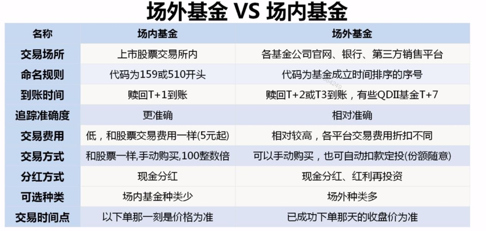

## 天天基金网实战
#### 基金基本信息
- 选择一个基金->基金概况
    - 资产规模
    - 基金管理人
    - 基金托管人
    - 管理费率
    - 托管费率
    - 申购费率
    - 赎回费率

#### 基金公司筛选
- 基金数据->基金公司->基金公司一览->基金公司排名列表（使用全部管理规模排序）->选择基金类型
- 基金公司->基金公司排名列表

#### 定投计算器
http://www.gffunds.com.cn/dtjsq/

#### 购买基金
- 直销渠道 费率中低
- 代销渠道
- 第三方基金销售机构（独立销售渠道）：费率最低

#### 基金类型
- 股票类基金
- 混合类基金
- 债券类基金
- 货币类基金

### 挑选原则
- 成立时间长
- 业绩好

### 概念
- 单位净值： 一份基金目前的价格（每天晚上8点半变化一次）
- 分红

- 累计净值：包括分红的净值
- 净值估算：提前预估今天净值，由于基金是长期投资，所以没啥用
- 基金规模：该基金所管理的总资产的规模（有多少钱买了这个基金）
    - 资产规模低于0.5亿可以被清算
    - 主动型基金10亿以上，但过大会影响收益（<70亿），指数型是被动型基金，规模越大越好

#### 基金
- 交易状态：
    - 场内基金： 场内交易 【在股票交易市场上买卖，使用股票交易软件操作，一手手买】
    - 场外基金：开放申购，开放赎回 【在股票交易市场外买卖】

- 基金封闭期： 新基金成立以后，为了建仓，初始化之类工作，资金也无法赎回（新手不考虑新基金）
- 股票持仓：是过去的公告信息，截止公告最后一天，持有的股票
    - 前十大重仓股超50%，相对激进
- 四分位排名图
    - 从右往左看，至少要有5年，每年排名要优秀，说明在熊市，牛市，震荡时，都优秀 （主动型基金考虑，被动型指数基金不用考虑这个）
- 风格箱
    - 公司规模：大盘，小盘，中盘
    - 投资潜力：价值，平衡，成长
- 基金招募说明书
    - 业绩比较基准也可以看出风险，基准设置低，说明风险低。
- 分类

    - 货币型基金 （国债，票据，银行存单，债券）
    - 债券型基金
    - 股票型基金
        - 主动型
        - 被动型（指数）
    - 混合型基金
        - 偏股
        - 偏债
- 指数查询
    - 中证指数公司 http://www.csindex.com.cn/
    - 深交所 http://www.szse.cn/market/exponent/sample/index.html

- 指数市盈率

    - 市盈率越低越有投资价值，市盈率越低说明这家公司的赚钱能力越强

