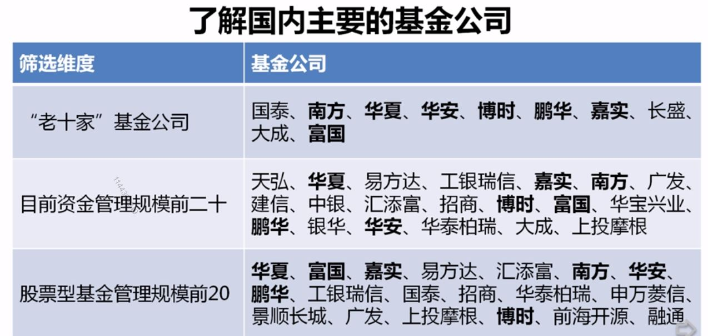
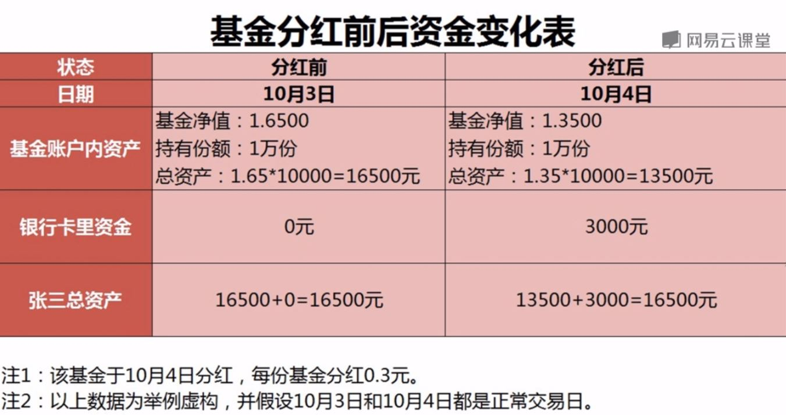

## 天天基金网实战
#### 基金基本信息
- 选择一个基金->基金概况
    - 资产规模
    - 基金管理人
    - 基金托管人
    - 管理费率
    - 托管费率
    - 申购费率
    - 赎回费率

#### 基金公司筛选
- 基金数据->基金公司->基金公司一览->基金公司排名列表（使用全部管理规模排序）->选择基金类型
- 基金公司->基金公司排名列表

#### 定投计算器
http://www.gffunds.com.cn/dtjsq/

#### 购买基金
- 直销渠道 费率中低
- 代销渠道
- 第三方基金销售机构（独立销售渠道）：费率最低

#### 基金类型
- 股票类基金
- 混合类基金
- 债券类基金
- 货币类基金

### 挑选原则
- 成立时间长
- 业绩好

### 概念
- 单位净值： 一份基金目前的价格（每天晚上8点半变化一次）
- 分红

- 累计净值：包括分红的净值
- 净值估算：提前预估今天净值，由于基金是长期投资，所以没啥用
- 基金规模：该基金所管理的总资产的规模（有多少钱买了这个基金）
    - 资产规模低于0.5亿可以被清算
    - 主动型基金10亿以上，但过大会影响收益（<80亿），指数型是被动型基金，规模越大越好